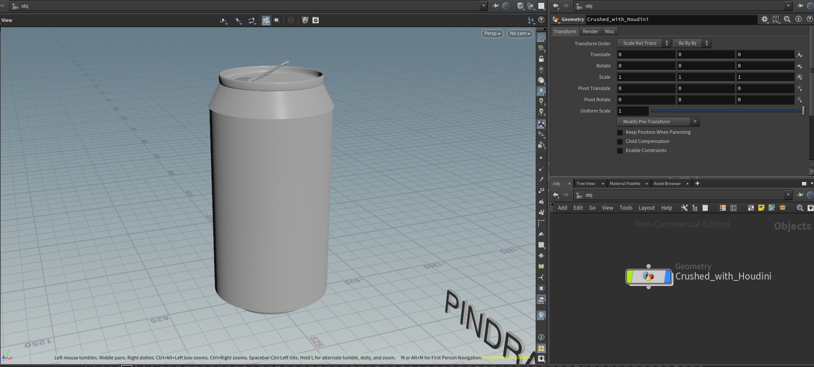
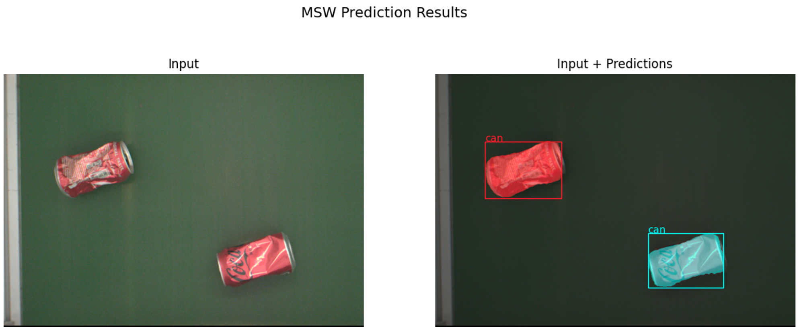

# SyntheticWasteGenerator

<p align="left">
<a href="https://github.com/SOTA-Robotics/MightyVision/actions/workflows/ci.yml"></a>
<a href="https://github.com/psf/black"></a>
</p>

## Overview
SWaG(Synthetic Waste Generator) is an automated synthetic data generation pipeline that creates an unlimited amount of high-fidelity image data for training AI-powered MSW(Municipal Solid Waste) recognition model. It consists of two main steps:

-  3D MSW Model Generation via [DPS](https://github.com/DrawZeroPoint/DPS)
-  2D MSW Image Data Generation via [Omniverse Replicator](https://developer.nvidia.com/omniverse/replicator) 

With the help of adjustable parameters, SWaG can be customized, such that unique images of MSW can be created under different lighting conditions, object textures and conveyor belt settings to meet specific customer demands.


## 3D MSW Model Generation
In the first step, SWaG takes arbitrary original object models from [ShapeNet](https://shapenet.org/) as input and automatically outputs their counterparts as MSW via DPS(Deformed by Physical Simulation) technology. Specifically, we use [Houdini](https://www.sidefx.com/) as DPS backend to implement plastic deformation of rigid bodies for generating synthetic 3D MSW models.

### Requirments
-  Houdini 19.5(apprentice)
-  Python 3.8

### Single 3D Model DPS
<!-- See [SDPS.md](./SDPS.md). -->
We first introduce how to generate single 3D MSW modle via DPS in Houdini.
#### User Guide
1.  Select a 3D shape(usually in .obj format) from [ShapeNet](https://shapenet.org/).
   
2.  Build the Houdini network as shown below:
   
3. Import the path of the selected 3D shape as the parameter of `file` node in the Houdini network, set the parameters of the other nodes properly. Details of parameter settings for different nodes can be found [here](https://clumsy-angora-757.notion.site/DPS-e896c9b6e4b949e4960dbeca092cfff4).
#### Run Demos
To start the DPS process for a Single MSW Model, you just need to launch the Houdini simulation after completing the above steps. We select a coke can with a customized texture as an example:
     

### Batch 3D Model DPS
To improve the efficiency of Single 3D MSW model DPS process, we use the [Python API](https://www.sidefx.com/docs/houdini/hom/hou/index.html) provided by Houdini to generate MSW models in batch from 3D shapes.
#### User Guide
1. Launch `External Python Editor` in Houdini.
   
2. Copy `./3D_model_generation/shapenet_can_crushing_dps.py` into `External Python Editor` and modify the parameters `shapenet_category_path` and `dps_saved_path` according to your local path.
3. Add `Python shell` in Houdini command window.
   <!--  -->
4. Run the command in `Python shell` to generate MSW models in batch: 
   ```python
   >>> dps = hou.session.Crushing_DPS()
   >>> dps.run()
   ```
#### Run Demos
Similarly, to start the batch DPS process for MSW Models, you just need to launch the Houdini simulation after completing the above steps. We select the 3D shapes of the can category in ShapeNet as an example for generating MSW models in batch:
    

#### Visualizing the Generated 3D MSW Models
You can use the [visualization script](3D_model_generation/batch_msw_model_visualizing.py) to visualize the generated MSW models in Houdini. It is useful when you want to check the quality of the MSW Models and remove defectives.

## 2D MSW Image Data Generation
In the second step, SWaG takes the generated 3D MSW models as input and directly outputs large-scale photorealistic MSW image data for training Mask R-CNN-based recognition model to enable automated composition analysis and sorting of MSW. Thanks to the superiority of RTX Rendering and Synthetic Data Generation (SDG) technology in [NVIDIA Omniverse](https://www.nvidia.cn/omniverse/) platform, we could produce large-scale photorealistic MSW image data from the generated 3D MSW models using [Omniverse Replicator SDK](https://developer.nvidia.com/omniverse/replicator).

### Requirments
-  Isaac Sim-2022.2.0
-  Omniverse Replicator-1.6.4

### Domain Randomization with Replicator
We first show how to apply Domain Randomization(DR) when using Replicator to enable SDG of MSW.
#### User Guide
-  Install Isaac Sim and Omniverse Replicator extension in Omniverse Launcher. Considering the code compatibility of this repo, we strongly recommend that you install the same version as decalred in `Requirments`. 
-  Import the generated 3D MSW models into Isaac Sim. Note that Isaac Sim uses .usd as the defult model format, thus you need to first convert the format of MSW models from .obj to .usd: 
   
-  Add semantic labels for the MSW models using `Semantic Schema Editor` in Isaac Sim:
   
-  Copy the scripts in `./2D_image_generation/dr_examples` to `Script Editor` window and click on the Run (Ctrl + Enter) button at the bottom of the Script Editor Window. This creates all the necessary nodes needed to run the DR workload of MSW SDG in Isaac Sim.
-  To executes these nodes to generate the randomized msw image data, click on the top left corner on Replicator in Isaac Sim. Details of the execution process as shown in [here](https://docs.omniverse.nvidia.com/prod_extensions/prod_extensions/ext_replicator/getting_started.html#running). 
#### Run Demos
Here we demonstrate some DR examples when using Replicator to generate msw image data in isaac ism:

-  Texture Randomization + Light Source Randomization: copy `./2D_image_generation/dr_examples/dr_texture_light.py`to `Script Editor` window and click on the Run button to launch DR process:
  
-  Texture Randomization + Light Source Randomization + Pose Randomization: copy `./2D_image_generation/dr_examples/dr_texture_light_pose.py`to `Script Editor` window and click on the Run button to launch DR process：
  

#### Visualizing Semantic Annotations
Since you have added semantic labels when importing the MSW models, you can visualize the annotation results of the generated msw image using `synthetic data sensor` button in Isaac Sim UI surface:
   

### Generate MSW Image Data in batch
Based on the functionalities of Replicator and Isaac Sim, we are able to generate randomized and unique MSW image data in batch via its Pthon API.
#### User Guide
-  Python Environment Installation: Isaac Sim provides a built-in Python 3.7 environment that packages can use. To use this Python environment when running the MSW Image Data generation scripts, you first need to move the whole `2D_image_generation` package to `~/.local/share/ov/pkg/isaac_sim-2022.2.0/`.
-  Mesh Converting: Before generating the 2D MSW image data, you need to batch convert the 3D MSW models format from .obj to .usd using the following command:
   1. set a variable to tell the script where to find the generated 3D MSW models locally
   ```shell
   export SHAPENET_LOCAL_DIR=<path/to/dps_saved_path>
   ```
   2. With the SHAPENET_LOCAL_DIR variable set, run the following script. Note, this will create a new directory at `{SHAPENET_LOCAL_DIR}_nomat` where the geometry-only USD files will be stored.
   ```shell
   cd .local/share/ov/pkg/isaac_sim-2022.1.1
   ./python.sh 2D_image_generation/scripts/utils/usd_convertor.py --categories can bottle --max_models 100
   ```
     
-  MSW Image Dataset Generation: Use the [data generation script](2D_image_generation/scripts/generate_msw_wastenet.py) to create an unlimited amount of high-fidelity MSW image data:  
   ```shell
   cd .local/share/ov/pkg/isaac_sim-2022.2.0
   ./python.sh ./2D_image_generation/scripts/generate_msw_wastenet.py --root $WASTENET_LOCAL_DIR'_nomat' --categories can bottle --max_asset_size 50
   ```
   An example of the automatically generated MSW image and annotations are shown below:
   

## MSW Recognition Model Training and Inference
After generating large-scale photorealistic MSW image data, it is required to validate the effectiveness of the synthetic data by training and testing the MSW Recognition Model.
### Model Training
Use the [training script](2D_image_generation/scripts/train_msw_recognition_model.py) for training the model with the synthetic data:

```shell
cd .local/share/ov/pkg/isaac_sim-2022.2.0/
./python.sh 2D_image_generation/scripts/train_msw_recognition_model.py --root $WASTENET_LOCAL_DIR'_nomat' --categories can bottle --visualize --max_asset_size 50
```
where `--visualize` is an `optional` flag. If given, the evaluation results for a certain iteration round of the trainig process will be saved in `2D_image_generation/assests/_out_train_imgs`. For example, the evaluation results of iteration 150 round is shown below:


### Model Inference
After training the model, you can use the [inference script](2D_image_generation/scripts/msw_recognition.py) for testing the model on a batch of real-world MSW images and visualizing the results:

```shell
cd .local/share/ov/pkg/isaac_sim-2022.2.0/
./python.sh 2D_image_generation/scripts/msw_recognition.py --root --visualize --categories can bottle
```
where `--visualize` is an `optional` flag. If given, the recognized results will be saved in `2D_image_generation/assests/_out_recognized_imgs`. `--root ` is an `defult` parameter that specifies the root directory containing the real-world msw images. This script will load the images one-by-one and display both the raw image and the recognized results: 



## The Team
SWaG is developed and maintained by the [CLOVER Lab (Collaborative and Versatile Robots Laboratory)](https://feichenlab.com/), CUHK.